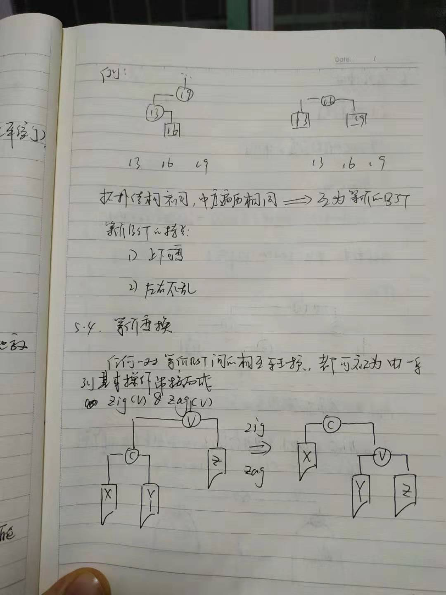
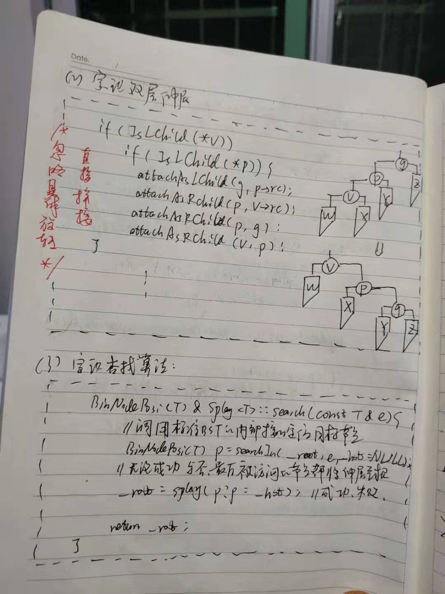
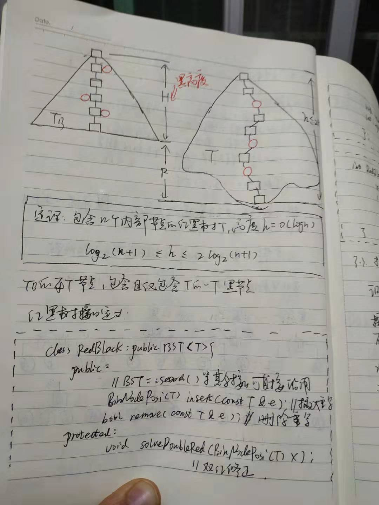
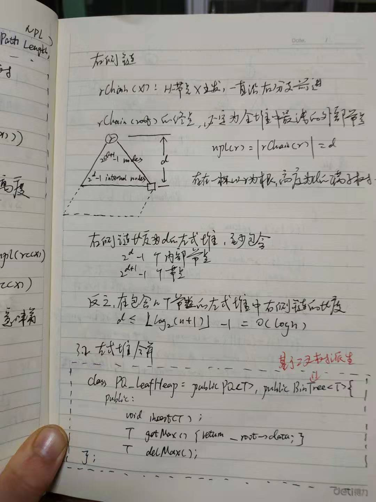
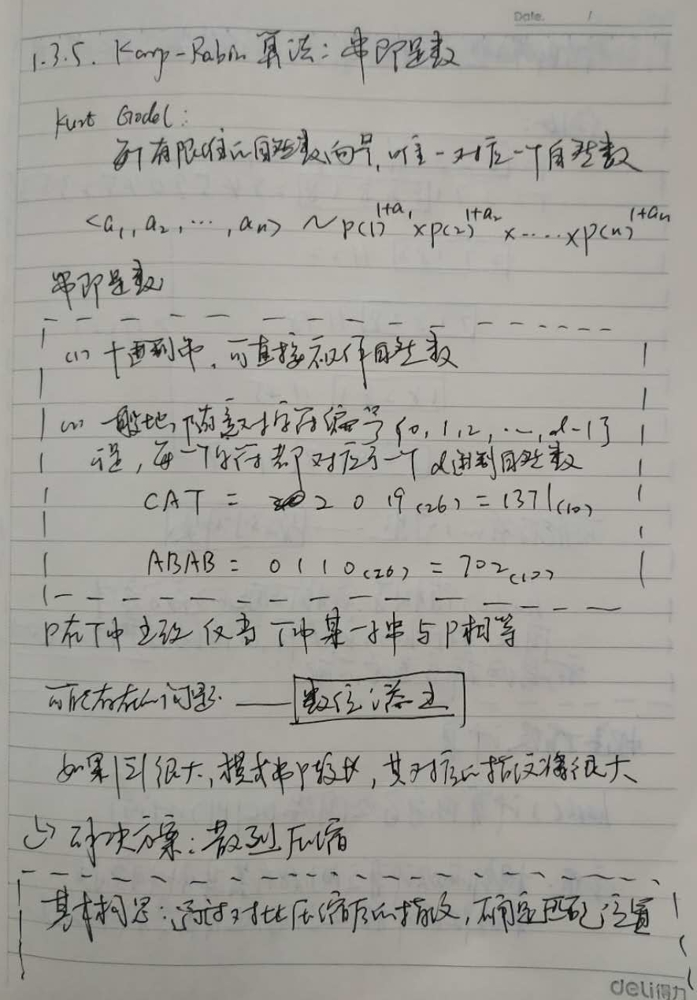

[目录](#content)
- [第一章 绪论](#chapter1)
    - [1.1. 什么是计算](#1-1)
    - [1.2. 什么是好计算](#1-2)
    - [1.3. 如何衡量DSA的时间成本](#1-3)
        - [1.3.1. 衡量时间成本的三种方法](#1-3-1)
        - [1.3.2. 如何计算T（n）](#1-3-2)
    - [1.4. 大O记号法：渐进复杂度](#1-4)
        - [1.4.1. 几种主要的复杂度](#1-4-1)
        - [1.4.2. 复杂度分析的方法](#1-4-2)
            - [1.4.2.1. 迭代](#1-4-2-1)
              - [1.4.2.1.1. 级数计算](#1-4-2-1-1)
              - [1.4.2.1.2. 图形分析](#1-4-2-1-2)
            - [1.4.2.2. 递归](#1-4-2-2)
                - [1.4.2.2.1. 递归跟踪](#1-4-2-2-1)
                - [1.4.2.2.2. 递推方程](#1-4-2-2-2)
        - [1.4.3. 递归的优缺点](#1-4-3)
        - [1.4.4. 用动态规划提高计算效率](#1-4-4)
- [第二章 向量](#chapter2)
    - [2.1. 向量的构造与析构](#2-1)
      - [2.1.1. 复制](#2-1-1)
      - [2.1.2. 扩充](#2-1-2)
    - [2.2. 无序向量的操作接口](#2-2)
        - [2.2.1. 插入](#2-2-1)
        - [2.2.2. 区间删除](#2-2-2)
        - [2.2.3. 查找](#2-2-3)
        - [2.2.4. 唯一化](#2-2-4)
    - [2.3. 有序向量的操作接口](#2-3)
        - [2.3.1. 去重](#2-3-1)
        - [2.3.2. 查找](#2-3-2)
            - [2.3.2.1. 版本A：初始二分查找](#2-3-2-1)
            - [2.3.2.2. 版本B：Fibonacci查找](#2-3-2-2)
            - [2.3.2.3. 版本C：二分查找改进](#2-3-2-3)
            - [2.3.2.4. 版本D：插值查找](#2-3-2-4)
    - [2.4. 从无序到有序：排序算法](#2-4)
        - [2.4.1. 起泡排序](#2-4-1)
        - [2.4.2. 归并排序](#2-4-2)
- [第三章 列表](#chapter3)
  - [3.1. 列表的构造](#3-1)
  - [3.2. 无序列表的操作接口](#3-2)
    - [3.2.1. 循秩访问](#3-2-1)
    - [3.2.2. 查找](#3-2-2)
    - [3.2.3. 插入](#3-2-3)
    - [3.2.4. 删除](#3-2-4)
    - [3.2.5. 唯一化](#3-2-5)
  - [3.3. 有序列表的操作接口](#3-3)
    - [3.3.1. 唯一化](#3-3-1)
    - [3.3.2. 查找](#3-3-2)
  - [3.4. 无序到有序：排序算法](#3-4)
    - [3.4.1. 选择排序](#3-4-1)
    - [3.4.2. 插入排序](#3-4-2)
    - [*3.4.3. 补充知识：逆序对](#3-4-3)
- [第四章 栈与队列](#chapter4)
  - [4.1. 栈的应用1：进制转换](#4-1)
  - [4.2. 栈的应用2：括号匹配](#4-2)
  - [4.3. 栈的应用3：栈混洗](#4-3)
  - [4.4. 栈的应用4：中缀表达式求值](#4-4)
  - [4.5. 栈的应用5：逆波兰表达式](#4-5)
- [第七章 二叉搜索树](#chapter7)
- [第八章 高级搜索树](#chapter8)
- [第九章 词典](#chapter9)
- [第十章 优先级队列](#chapter10)
- [第十一章 串比对](#chapter11)

<a name='chapter1'><h2>第一章 绪论</h2></a>

<a name='chapter2'><h2>第二章 向量</h2></a>

<a name='chapter3'><h2>第三章 列表</h2></a>

<a name='chapter4'><h2>第四章 栈与队列</h2></a>

<a name='chapter7'><h2>第七章 二叉搜索树</h2></a>

<a name='chapter8'><h2>第八章 高级搜索树</h2></a>

<a name='chapter9'><h2>第九章 词典</h2></a>

<a name='chapter10'><h2>第十章 优先级队列</h2></a>

<a name='chapter11'><h2>第十一章 串比对</h2></a>

